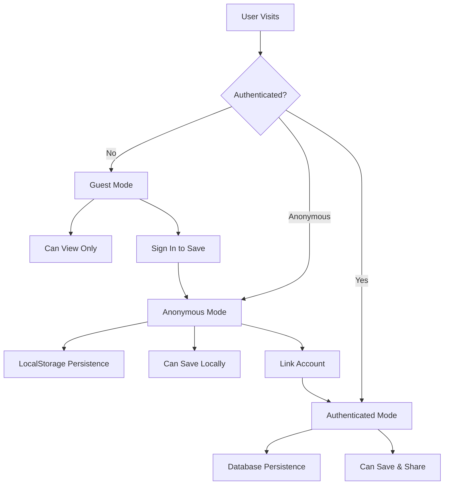
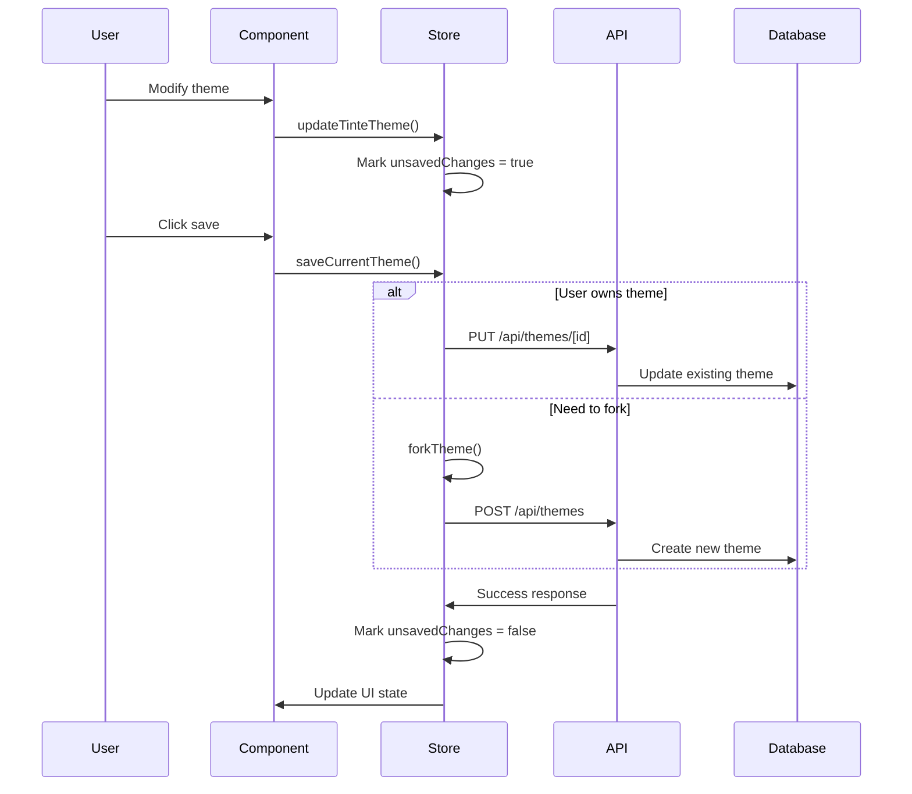
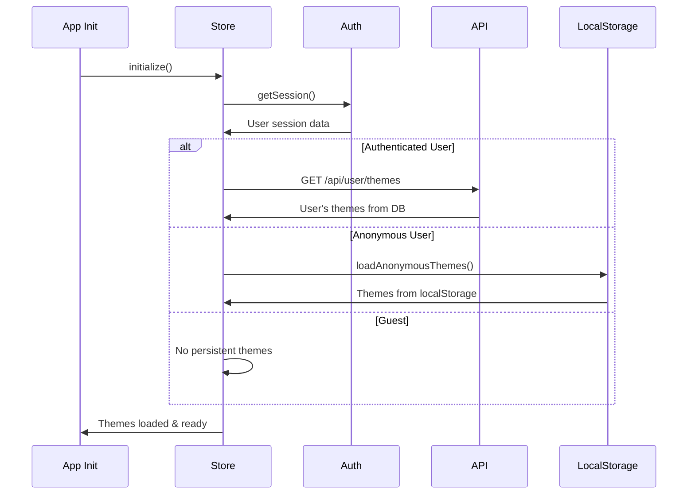

# Theme Persistence System

A comprehensive system for saving, managing, and sharing themes with support for anonymous users, authentication, and theme forking.

## Overview

The theme persistence system provides a seamless experience for users to create, modify, and save themes regardless of their authentication status. It includes intelligent ownership detection, automatic forking for shared themes, and persistent storage across sessions.

## Architecture

### Core Components

```
src/
├── stores/persistent-theme-store.ts    # Main persistence store
├── hooks/use-persistent-theme.ts       # React hook for components
├── providers/theme.tsx                 # Theme context provider
├── components/auth/                    # Authentication components
├── app/api/themes/                     # REST APIs for theme CRUD
└── lib/auth.ts                        # Better Auth with anonymous plugin
```

### Authentication Flow



## User States

### 1. Guest User (Not Signed In)

- **Storage**: None
- **Capabilities**:
  - View and modify themes temporarily
  - No persistence between sessions
  - Cannot save themes
- **UI Indicators**: No ownership badges
- **Actions Available**:
  - Sign in anonymously
  - View theme modifications (lost on refresh)

### 2. Anonymous User

- **Storage**: localStorage
- **Capabilities**:
  - Save themes locally
  - Persistent across browser sessions
  - Cannot share publicly
  - Themes stored only in browser
- **UI Indicators**: `Anonymous` badge in user dropdown
- **Actions Available**:
  - Save themes locally
  - Link to GitHub account
  - Fork shared themes

### 3. Authenticated User

- **Storage**: PostgreSQL database
- **Capabilities**:
  - Save themes to database
  - Share themes publicly
  - Own themes with user attribution
  - Access themes from any device
- **UI Indicators**: User avatar and name
- **Actions Available**:
  - Save, edit, delete own themes
  - Fork other users' themes
  - Make themes public/private

## Theme Ownership & Forking

### Ownership Detection

```typescript
const isOwnTheme = activeTheme?.user?.id === user?.id;
const isUserTheme = !!activeTheme?.user;
const needsFork = isUserTheme && !isOwnTheme && (unsavedChanges || !canSave);
```

### Fork Behavior

When a user attempts to edit a theme they don't own:

1. **Automatic Fork Creation**:

   ```typescript
   const forkedTheme = {
     ...originalTheme,
     id: `fork_${Date.now()}`,
     name: `${originalTheme.name} (Fork)`,
     author: user?.name || "You",
     user: currentUser,
     tags: [...originalTheme.tags, "fork"],
   };
   ```

2. **Seamless Transition**: User can immediately edit the forked version
3. **Clear Attribution**: Original author is preserved in theme metadata

### UI Indicators

The theme switcher displays ownership status:

- `👤 Yours` - User owns this theme
- `👥 Shared` - Theme by another user (read-only)
- `🔒 Fork to edit` - Theme requires forking to edit
- `🟠` - Orange dot indicates unsaved changes

## Persistence Strategies

### LocalStorage (Anonymous Users)

```typescript
const ANONYMOUS_THEMES_KEY = "tinte-anonymous-themes";

// Save themes locally
function saveAnonymousThemes(themes: ThemeData[]): void {
  localStorage.setItem(ANONYMOUS_THEMES_KEY, JSON.stringify(themes));
}

// Load on app initialization
function loadAnonymousThemes(): ThemeData[] {
  const stored = localStorage.getItem(ANONYMOUS_THEMES_KEY);
  return stored ? JSON.parse(stored) : [];
}
```

### Database (Authenticated Users)

Theme data is stored with full relational structure:

```sql
-- Core theme data (13 canonical colors)
CREATE TABLE theme (
  id TEXT PRIMARY KEY,
  user_id TEXT REFERENCES user(id),
  name TEXT NOT NULL,

  -- Light mode colors
  light_bg TEXT NOT NULL,
  light_ui TEXT NOT NULL,
  light_tx TEXT NOT NULL,
  light_pr TEXT NOT NULL,
  light_sc TEXT NOT NULL,
  light_ac_1 TEXT NOT NULL,
  -- ... additional colors

  -- Dark mode colors
  dark_bg TEXT NOT NULL,
  -- ... (mirrors light mode structure)

  -- Provider overrides
  shadcn_override JSONB,
  vscode_override JSONB,
  shiki_override JSONB,

  is_public BOOLEAN DEFAULT true,
  created_at TIMESTAMP DEFAULT NOW()
);
```

### Migration Between Storage Types

When anonymous users authenticate:

```typescript
// Better Auth onLinkAccount callback
onLinkAccount: async ({ anonymousUser, newUser }) => {
  // Transfer themes from anonymous user to new authenticated user
  await db
    .update(schema.theme)
    .set({ user_id: newUser.user.id })
    .where(eq(schema.theme.user_id, anonymousUser.user.id));
};
```

## API Endpoints

### Theme CRUD Operations

```typescript
// Create new theme
POST /api/themes
Body: {
  name: string,
  tinteTheme: TinteTheme,
  overrides: { shadcn?, vscode?, shiki? },
  isPublic: boolean
}

// Get user's themes
GET /api/user/themes

// Get public themes
GET /api/themes?public=true

// Update theme (owner only)
PUT /api/themes/[id]

// Delete theme (owner only)
DELETE /api/themes/[id]

// Get single theme
GET /api/themes/[id]
```

### Authentication Check

All theme modification endpoints verify ownership:

```typescript
// Check if theme exists and belongs to user
const existingTheme = await db
  .select()
  .from(theme)
  .where(
    and(
      eq(theme.id, id),
      eq(theme.user_id, session.user.id), // Ownership check
    ),
  )
  .limit(1);
```

## Data Flow

### Theme Creation Flow



### Theme Loading Flow



## UI Integration

### Dock Integration

The dock's "More Actions" panel includes persistence controls:

```typescript
// Conditional rendering based on user state
{needsFork && (
  <Button onClick={onFork}>
    <GitFork /> Fork to Edit
  </Button>
)}

{unsavedChanges && canSave && !needsFork && (
  <Button onClick={onSave}>
    <Save /> Save Theme
  </Button>
)}

{!isAuthenticated && (
  <AnonymousSignInButton>
    <UserPlus /> Sign in to Save
  </AnonymousSignInButton>
)}
```

### Theme Switcher Enhancement

Visual indicators provide immediate feedback:

```typescript
// Ownership status badges
{needsFork && (
  <Badge variant="outline">
    <Lock /> Fork to edit
  </Badge>
)}

{isOwnTheme && (
  <Badge variant="secondary">
    <User /> Yours
  </Badge>
)}

{unsavedChanges && (
  <div className="w-2 h-2 bg-primary rounded-full" />
)}
```

## Error Handling

### Graceful Degradation

- **Network failures**: Fall back to localStorage
- **Authentication errors**: Maintain anonymous mode
- **Storage quota exceeded**: Warn user and limit saves
- **Concurrent modifications**: Last-write-wins with user notification

### Error Recovery

```typescript
// Save with fallback
const saveTheme = async () => {
  try {
    if (isAuthenticated) {
      return await saveToDatabase();
    } else {
      return saveToLocalStorage();
    }
  } catch (error) {
    console.error("Save failed:", error);
    // Show user-friendly error
    toast.error("Failed to save theme. Try again.");
    return false;
  }
};
```

## Performance Considerations

### Optimistic Updates

```typescript
// Update UI immediately, sync to storage after
const updateTheme = (updates) => {
  // 1. Update local state immediately
  setTheme(updates);

  // 2. Debounced save to storage
  debouncedSave(updates);
};
```

### Efficient Synchronization

- **Debounced saves**: Prevent excessive API calls during rapid editing
- **Change detection**: Only save when actual changes detected
- **Batch operations**: Group multiple theme property updates

### Memory Management

- **Theme cleanup**: Remove unused themes from memory
- **Storage limits**: Monitor localStorage usage
- **Image optimization**: Compress theme preview images

## Security

### Authorization

- **Server-side validation**: All theme modifications verified on API level
- **User ownership**: Strict checks prevent unauthorized theme access
- **Input sanitization**: Theme data validated before storage

### Privacy

- **Public/private themes**: User control over theme visibility
- **Anonymous data**: No tracking of anonymous users
- **Data portability**: Users can export all their themes

## Future Enhancements

### Planned Features

1. **Collaboration**: Multiple users editing shared themes
2. **Version History**: Track theme changes over time
3. **Import/Export**: Bulk theme operations
4. **Theme Templates**: Predefined starting points
5. **AI Integration**: Smart color suggestions
6. **Performance Metrics**: Theme usage analytics

### Technical Improvements

1. **Offline Support**: Service Worker for offline editing
2. **Real-time Sync**: WebSocket-based live updates
3. **Conflict Resolution**: Advanced merge strategies
4. **Theme Validation**: Comprehensive accessibility checking
5. **Backup System**: Automated theme backups

## Testing Strategy

### Unit Tests

- Theme transformation functions
- Storage utilities
- Authentication flows

### Integration Tests

- API endpoint functionality
- Database operations
- User state transitions

### E2E Tests

- Complete user workflows
- Cross-browser compatibility
- Mobile responsiveness

This persistence system provides a robust foundation for theme management while maintaining simplicity for users and flexibility for developers.
